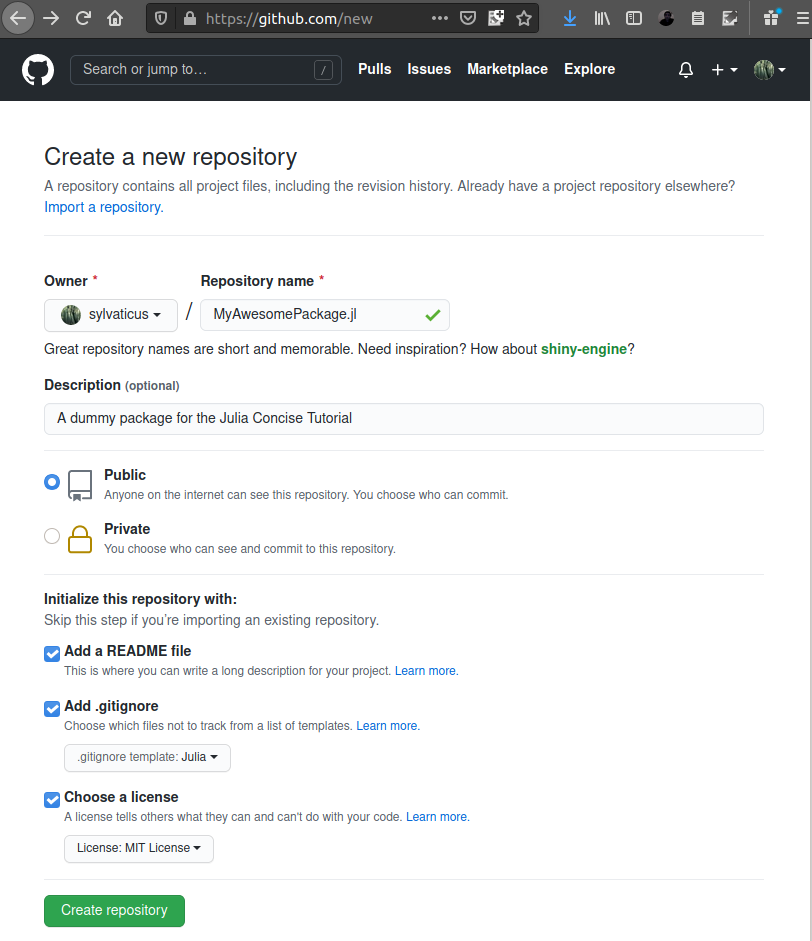
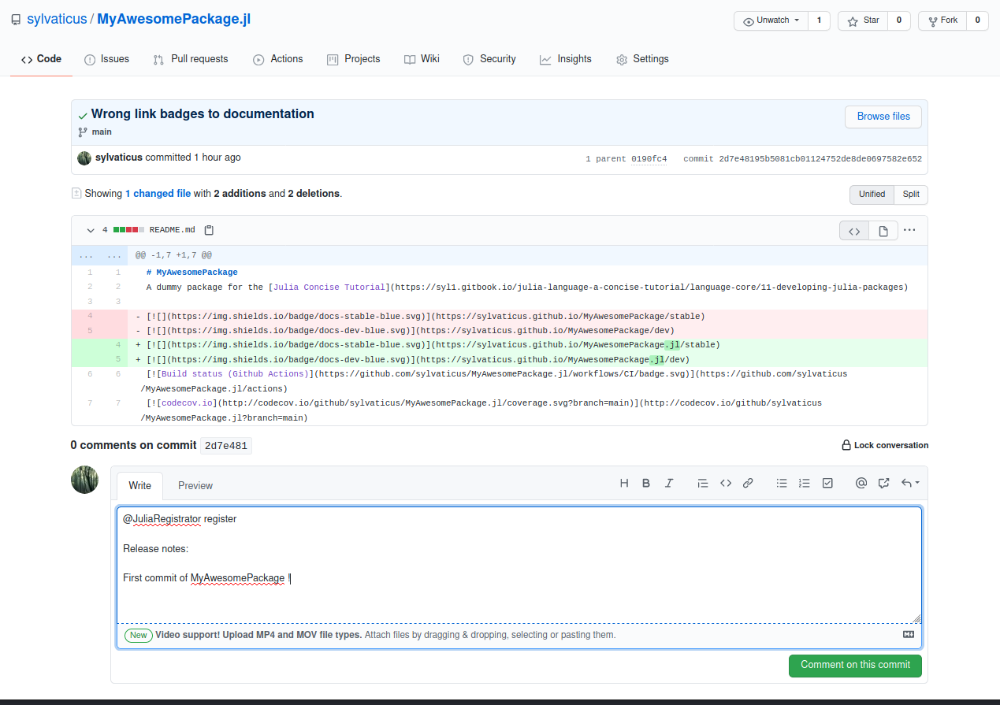

# 11 - Julia Modules and Packages

## Understanding modules

The main objective of modules is to provide separate namespaces for global names in Julia.

The basic structure of a module is:

```julia
module ModuleName
export myObjects # functions, structs, and other objects that will be directly available once `using ModuleName` is typed

[...module code...]

end
```

Module names are customary starting with a capital letter and the module content is usually not indented.
Modules can be entered in the REPL as normal Julia code or in a script that is imported with `import("file.jl")`.

There is no connection between a given file and a given module as in other languages, so the logical structure of a program can be decoupled from its actual division in files. For example, one file could contain multiple modules.

A more common way to use modules is by loading a package that will consists, at least, of a module with the same name of the package.

All modules are children of the module `Main`, the default module for global objects in Julia, and each module defines its own set of global names.

**Note:** _`using` and `import`, when they are followed with either `Main.x` or `.x`, look for a module already loaded and bring it and its exported objects into scope (for `import` only those explicitly specified). Otherwise, they do a completely different job: they expects a **package**, and the package system lookups the correct **version** of the module `x` embedded inside package `x`, it loads it, and it bring it and its exported objects into scope (again, for `import x` only those explicitly specified)._

Modules can include submodules, although there exists a large opinion in the Julia community that this, unless it is really necessary, should be avoided, and use the dot notation to indicate the hierarchy.

The following example uses the [Reexport](https://github.com/simonster/Reexport.jl) package that provides an handy method to re-export automatically all the objects of an imported module.

```julia
module Foo
export plusOne, Foo3, Foo4
plusOne(x) = x + 1
plusTen(x) = x + 10
module Foo3
    export plusThree
    plusThree(x) = x+3
end
module Foo4
    using Reexport
    export plusFour
    @reexport using ..Foo3 # note the two dots in front to go one level up, as these two modules are siblings
    plusFour(x) = x+4
end
end # end Foo
```
Assuming we have loaded it into memory (e.g. by typing it directly in the REPL) we can now use the module in several ways:

```julia
Foo.plusOne(2)        # Ok
Foo.plusTen(2)        # Ok
Foo.Foo4.plusThree(2) # OK
plusOne(2)            # Error, the objects of Foo are not into scope
using .Foo            # We bring the exported objects into scope
plusOne(2)            # Now it works
plusTen(2)            # Error, plusTen is not exported
import .Foo: plusTen  # We explicitly bring it into scope
plusTen(2)            # Now it is in scope
plusThree(2)          # Error, not in scope
Foo3.plusThree(2)     # Ok
Foo4.plusThree(2)     # Ok, as Foo4 re-exports the exported objects of Foo3
```
You can read more about modules in the [modules section](https://docs.julialang.org/en/v1/manual/modules/#modules) of the official documentation.


## Developing Julia packages

A package is nothing else that a collection of one or more hierarchically connected modules (at least one with the same name of the package acting on top of the hierarchy) logically connected to provide a given functionality, enriched with metadata that make the discovery, usage and interconnection of modules much simpler.
Hence, before developing a package, be sure you fully understand how modules behave in Julia, as described in the previous section.

**Note:** _As in the rest of the tutorial, when you read `julia> command` the command has to be issued in a Julia session, while with `(@v1.X) pkg> command` the command has to be issued in the special "package" mode of Julia (type `]` in a Julia session to access it,`[DEL]` to return to the Julia main prompt)._

<!--
## Patching other people's packages:

* pkg&gt;  `develop pkgName`
* \[patch & commit\]
* `using PkgDev; PkgDev.submit(pkgName)`
-->

We assume that we want to create a package using GitHub as repository host and continuous integration tools. We also assume we are using Julia >= v.1.2.0.
We will go trough the process of creating the package from scratch and implement automatic testing ([next section](#pkg_creation)), document our newly created package ([folowing section](#pkg_documentation)) and finally register it within the official Julia Register, so that other people can find and install the package easily ([last section](#pkg_registration)).

### <a name="pkg_creation"></a>Creating the package and implementing tests

First, we create the repository in GitHub, considering a package name that follows the Julia's [package naming guidelines](https://julialang.github.io/Pkg.jl/v1/creating-packages/#package-naming-guidelines) and, by custom, calling the repository by the package name followed by the ".jl" prefix.
For example, in this tutorial we chose as package name `MyAwesomePackage`, and the corresponding GitHub repository will be `MyAwesomePackage.jl`.

Don't forget to add a readme (so we can already clone the repository) and choose `Julia` as gitignore template:



**Tip:** _Are you in a rush? Clone [MyAwesomePackage.jl](https://github.com/sylvaticus/MyAwesomePackage.jl) and adapt it to your needs._

The repository doesn't yet contain the minimum set of information that allows it to be downloaded as a "Julia package", hence we will first generate a basic package structure locally, using the Julia tool `generate`. We will then commit and link this git repository with the remote GitHub repository we just made, push the basic package structure to GitHub and, at that point, we can download it again as a Julia Package and continue its development.

So, let's generate our package locally. We cd to a directory where we want the new package to appear as a subfolder (for example our Desktop), enter the Julia prompt and type `(@v1.X) pkg> generate MyAwesomePackage`.

This will create a new folder `MyAwesomePackage` with a `src` subfolder that includes a "Hello world" version of our awesome package and, most importantly, the `Project.toml` file.
For now, this includes just: (a) the name of the package; (b) the author; (c ) the unique id that has been assigned to the new package (this is a code that depends from stuff like the MAC address, the exact time, the process id, etc...) and (d) the initial version of the package.
Check that the author and initial version are ok for you (for example I prefer to start a package with version `0.0.1` rather than the default `0.1.0`).

`Project.toml` will also hold the dependencies that our package will require. So, for example, let's assume that `MyAwesomePackage` depends from the packages `LinearAlgebra` (a standard lib package) and `DataFrames`(a popular third-party package to work with tabular data, aka "dataframes").

We first "activate" the new `MyAwesomePackage` folder with `(@v1.X) pkg> activate(FULL_PATH/MyAwesomePackage)`. We can now add the two packages with `(MyAwesomePackage) pkg> add LinearAlgebra DataFrames`. From the message in output, we take note that the DataFrame version is `v0.22.2`.
Going back to our new `Project.toml` file, the two packages should have been added to the `[deps]` section. We now want to specify the version of the third-party packages our `MyAwesomePackage` works with, and in particular, if we want to register it in the official Julia registry, we need to specify an **upper** version.
We can do that by adding to `Project.toml` a new `[compat]` section where we write down `DataFrames = "0.21, 0.22"`, that is we allow `MyAwesomePackage` to work with any `DataFrames` in the `v0.21.x` or `v0.22.x` series. In other words, we assume that the functionality our package depends from has been introduced in `DataFrames` `v0.21.O`, and it is still available in the `v0.22.x` serie.

We also add `julia = "1.2.1"` assuming that our package works only with `Julia >= v1.2.1` within the `v1.x` serie.

_**NOTE:** All Julia versions in the `v1.x` serie are "guaranteed" to be backward compatible with code wrote for Julia `v1.0.0`, but the reverse is not true, e.g. new features could still be added in the `v1.x` serie so that certain packages work only with them._

On one side this way to manage dependencies brings a considerable burden on the package maintainer, as it is his responsibility to determine which exact versions of the dependent package his package works with, but on the other side it guarantees a smooth usage of his/her package.
More information on Julia semantic rules can be found [here](https://julialang.github.io/Pkg.jl/dev/toml-files/#The-version-field) and in particular the requirements for automatic merging of the package in the registry are given [here](https://github.com/JuliaRegistries/General#automatic-merging-of-pull-requests).

`Project.toml` should look at the end similar to this :

```
name = "MyAwesomePackage"
uuid = "19daf8e9-0870-4f25-9c1d-f38ed379fe1e"
authors = ["Antonello Lobianco <myName@mySurname.org>"]
version = "0.0.1"

[deps]
DataFrames = "a93c6f00-e57d-5684-b7b6-d8193f3e46c0"
LinearAlgebra = "37e2e46d-f89d-539d-b4ee-838fcccc9c8e"

[compat]
DataFrames = "0.21, 0.22"
julia = "1.2.1"
```

Our new package is now ready to be linked with the repository we created in GitHub. While in this tutorial we will use a terminal, you can just use the github web interface to copy the files `generate` has produced to your github repository.

Let leave Julia for now and go to the local repository with a terminal and run the following commands in the terminal:

```
git init     # Initialise the git repository
git add .    # Add all files, including in subfolders
git commit -a -m "Initial package structure of MyAwasomePackage" # Create a first commit
git branch -m main # Rename "master" to "main" as of the new GitHub policy
git remote add origin https://github.com/sylvaticus/MyAwesomePackage.jl.git # Link the remote github repository to the local one
git pull origin main --allow-unrelated-histories # Fetch the Readme and gitignore we created when we created the repository
git push --set-upstream origin main # Finally upload everything back to the GitHub repository
```

Once we have the package in GitHub, we can add it to our Julia local installation with `(@v1.X) pkg> add https://github.com/sylvaticus/MyAwesomePackage.jl.git` and `(@v1.X) pkg> dev MyAwesomePackage`.
The package should now located in `[USER_HOME_FOLDER]/.julia/dev/MyAwesomePackage`, where `[USER_HOME_FOLDER]` is the home folder for the local user, e.g. `~` in Linux or `%HOMEPATH%` in Windows and we can cancel the original location where we generated it (for example in our Desktop).

Before we add a test suite, let's add a minimum of functionality to our package. I highly advise you to use the [Revise](https://github.com/timholy/Revise.jl) package. When you import `Revise` in a new Julia session before importing a package it lets you account for changes that you make when you save on disk any modification you make on the package without having to restart the Julia session.

So let's add a function `plusTwo` to our package by editing `MyAwesomePackage/src/MyAwesomePackage.jl` as follow:

```julia
module MyAwesomePackage

export plusTwo

plusTwo(x) = return x+2

end # end module
```

We can now add a test suite to our package. We add the following file (and folder) `[USER_HOME_FOLDER]/.julia/dev/MyAwesomePackage/test/runtests.jl`:

```julia

using Test, MyAwesomePackage # This load both the test suite and our MyAwesomePackage

out = plusTwo(3)

@test out == 5               # This is the actual test condition. You can add as many tests as you wish.
```

Before we can run the test we still need to tell Julia that when testing the package, the standard lib `Test` needs to be added to the package:

```
(@v1.x) pkg> activate [USER_HOME_FOLDER]/.julia/dev/MyAwesomePackage/test/
add Test
(test) pkg> activate # Without arguments, "activate" brings back to the default environment
(@v1.x) pkg> test MyAwesomePackage  # This perform the test
```
From now on, to add a dependency:
- to the package itself --> `activate [USER_HOME_FOLDER]/.julia/dev/MyAwesomePackage` and `(MyAwesomePackage) pkg> add MyDependencyPackage` --> the new package will be recorded in the `[deps]` section of `[USER_HOME_FOLDER]/.julia/dev/MyAwesomePackage/Project.toml` (don't forget to add a upper bound if the package is not in the standard library)
- to the testing system only (i.e. something the package doesn't rely to, but it is needed for testing, for example a package to load a  specific datasets) --> `activate [USER_HOME_FOLDER]/.julia/dev/MyAwesomePackage/test` and `(test) pkg> add MyDependencyPackage` --> the new package will be recorded in the `[deps]` section of `[USER_HOME_FOLDER]/.julia/dev/MyAwesomePackage/test/Project.toml`

Before we `git commit` and `git push` our `MyAwesomePackage`, let's add a functionality that at each time the package is pushed, github performs an operation (github calls these operation "actions"), and in particular it automatically runs the test for us.

Let's add the folder/file `[USER_HOME_FOLDER]/.julia/dev/MyAwesomePackage/.github/workflow/ci.yml`:

```
name: CI
on:
  pull_request:
    branches:
      - main
  push:
    branches:
      - main
    tags: '*'
jobs:
  test:
    name: Julia ${{ matrix.version }} - ${{ matrix.os }} - ${{ matrix.arch }} - ${{ github.event_name }}
    runs-on: ${{ matrix.os }}
    strategy:
      fail-fast: false
      matrix:
        version:
          - '1.3.1' # Replace this with the minimum Julia version that your package supports. E.g. if your package requires Julia 1.5 or higher, change this to '1.5'.
          - '1' # Leave this line unchanged. '1' will automatically expand to the latest stable 1.x release of Julia.
        os:
          - ubuntu-latest
          - macOS-latest
          - windows-latest
        arch:
          - x64
    steps:
      - uses: actions/checkout@v2
      - uses: julia-actions/setup-julia@v1
        with:
          version: ${{ matrix.version }}
          arch: ${{ matrix.arch }}
      - uses: actions/cache@v1
        env:
          cache-name: cache-artifacts
        with:
          path: ~/.julia/artifacts
          key: ${{ runner.os }}-test-${{ env.cache-name }}-${{ hashFiles('**/Project.toml') }}
          restore-keys: |
            ${{ runner.os }}-test-${{ env.cache-name }}-
            ${{ runner.os }}-test-
            ${{ runner.os }}-
      - uses: julia-actions/julia-buildpkg@v1
      - uses: julia-actions/julia-runtest@v1
      - uses: julia-actions/julia-processcoverage@v1
      - uses: codecov/codecov-action@v1
        with:
          file: lcov.info
  docs:
    name: Documentation
    runs-on: ubuntu-latest
    steps:
      - uses: actions/checkout@v2
      - uses: julia-actions/setup-julia@v1
        with:
          version: '1'
      - run: |
          julia --project=docs -e '
            using Pkg
            Pkg.develop(PackageSpec(path=pwd()))
            Pkg.instantiate()'
      - run: |
          julia --project=docs -e '
            using Documenter: doctest
            using MyAwesomePackage     # change MyAwesomePackage to the name of your package
            doctest(MyAwesomePackage)' # change MyAwesomePackage to the name of your package
      - run: julia --project=docs docs/make.jl
        env:
          GITHUB_TOKEN: ${{ secrets.GITHUB_TOKEN }}
          DOCUMENTER_KEY: ${{ secrets.DOCUMENTER_KEY }}
      - uses: julia-actions/julia-processcoverage@v1
      - uses: codecov/codecov-action@v1
```

The above script, on top of running the tests, will (1) initialise the service [codecov](https://about.codecov.io/) to highlight the lines of code that are actually covered by the testing (you will need to first authorise codecov with the "Add new repository" on its web interface - after you log in), and (2) will start the building of the package's documentation (see the following section).
If you need to add some tests that are "allowed" to fail (typically, to test on Julia night builds), you can write a similar workflow file (see [an example](https://github.com/sylvaticus/MyAwesomePackage.jl/blob/main/.github/workflows/ci-nightly.yml)).

At this point we can add the first "badges" on our package README.md:

```
[](https://github.com/sylvaticus/MyAwesomePackage.jl/actions)
[](http://codecov.io/github/sylvaticus/MyAwesomePackage.jl?branch=main)
```
The first one concerns the building status and the second one the line coverage.

Having an upper limit of the dependencies means that our package, if installed, would "limit" that dependencies in the user's environment. We hence need to continuously check for new versions of the dependencies or it will ends that our package constrains the users to keep old packages installed on his/her system.
Something that comes in handy is the following action: it checks for us if any of our dependencies has a new version and open for us a pull request to
account for such version in our project's `Project.toml`. But attention, it is still up to us to check that indeed the new version works with our package!

`[USER_HOME_FOLDER]/.julia/dev/MyAwesomePackage/.github/workflow/CompatHelper.yml`:

```
name: CompatHelper

on:
  schedule:
    - cron: '00 00 * * *'

jobs:
  CompatHelper:
    runs-on: ubuntu-latest
    steps:
      - name: Pkg.add("CompatHelper")
        run: julia -e 'using Pkg; Pkg.add("CompatHelper")'
      - name: CompatHelper.main()
        env:
          GITHUB_TOKEN: ${{ secrets.GITHUB_TOKEN }}
          COMPATHELPER_PRIV: ${{ secrets.DOCUMENTER_KEY }}
        run: julia -e 'using CompatHelper; CompatHelper.main()'
```
Also, please note that this action is automatically triggered at any given interval. GitHub stops this kinds of cron-based actions for inactive repositories, sending a warning email to you to prevent it. So, until a more solid solution is found, check your email if your repository is no longer actively developed!

With out package in `[USER_HOME_FOLDER]/.julia/dev/MyAwesomePackage/` we can continue to develop it, commit the changes and push them to GitHub (behind the scenes, the `add` and `dev` Julia package commands did actually cloned the GitHub repository to `.julia/dev/MyAwesomePackage/`, so we can use directly git commands on that directory, like `git commit -a -m "Commit message"` or `git push`).

This conclude the section about developing (and testing) a package. You can read more details [here](https://julialang.github.io/Pkg.jl/v1/creating-packages/), including how to specify a personalised building workflow.


### <a name="pkg_documentation"></a>Documenting our package

It is a good practice to document your own functions. You can use triple quoted strings (""") just before the function to document and use Markdown syntax on it. The Julia documentation [recommends](https://docs.julialang.org/en/v1/manual/documentation/) that you insert a simplified version of the function, together with an `Arguments` and an `Examples` sections.  
For example, this is the documentation string for our `plusTwo` function.


    """
        plusTwo(x)

    Sum the numeric "2" to whatever it receives as input

    A more detailed explanation can go here, although I guess it is not needed in this case

    # Arguments
    * `x`: The amount to which we want to add 2

    # Notes
    * Notes can go here

    # Examples
    ```julia
    julia> five = plusTwo(3)
    5
    ```
    """


The documentation string for a function or a module should be placed exactly on top of the item to document (no empty lines) and it will be rendered when a user type `?<FUNCTION OR MODULE NAME>` or in the documentation pages that we are going to build.

In order to process to the building of the documentation pages, we produce a skeleton of the documentation configuration files using the following commands:

```julia
(@v1.x) pkg>  activate          # Documenter needs to be added to your general Julia registry, not your package specific one
(@v1.x) pkg>  add Documenter
(@v1.x) pkg>  add DocumenterTools
julia> using DocumenterTools
julia> cd("[USER_HOME_FOLDER]/.julia/dev/MyAwesomePackage/")
julia> generate()
```
This should produce an output similar to the following:
```
[ Info: name of package automatically determined to be `MyAwesomePackage`.
[ Info: deploying documentation to `~/.julia/dev/MyAwesomePackage/docs`
[ Info: Generating .gitignore at /home/lobianco/.julia/dev/MyAwesomePackage/docs/.gitignore
[ Info: Generating make.jl at /home/lobianco/.julia/dev/MyAwesomePackage/docs/make.jl
[ Info: Generating Project.toml at /home/lobianco/.julia/dev/MyAwesomePackage/docs/Project.toml
[ Info: Generating src/index.md at /home/lobianco/.julia/dev/MyAwesomePackage/docs/src/index.md
```

While `generate()` produce a _basic_ documentation configuration we are going to extend it a bit in order to have (a) multiple pages, (b) automatic inclusion of all documented items and (c ) hosting (deployment) of the documentation in GitHub pages.
All these steps are documented in deep in the `Documenter` [own documentation](https://juliadocs.github.io/Documenter.jl/stable/man/guide/#Package-Guide). Note that the `docs` folder has its own `Project.toml`, so you can add documentation-specific packages there.

Let's then change the `[USER_HOME_FOLDER]/.julia/dev/MyAwesomePackage/docs/make.jl`:

```
using Documenter
using MyAwesomePackage

push!(LOAD_PATH,"../src/")
makedocs(sitename="MyAwesomePackage.jl Documentation",
         pages = [
            "Index" => "index.md",
            "An other page" => "anotherPage.md",
         ],
         format = Documenter.HTML(prettyurls = false)
)
# Documenter can also automatically deploy documentation to gh-pages.
# See "Hosting Documentation" and deploydocs() in the Documenter manual
# for more information.
deploydocs(
    repo = "github.com/sylvaticus/MyAwesomePackage.jl.git",
    devbranch = "main"
)
```

Let's consider  `[USER_HOME_FOLDER]/.julia/dev/MyAwesomePackage/docs/anotherPage.md`:


    # The MyAwesomePackage Module

     ```@docs
     MyAwesomePackage
     ```

    ## Module Index

    ```@index
    Modules = [MyAwesomePackage]
    Order   = [:constant, :type, :function, :macro]
    ```
    ## Detailed API

    ```@autodocs
    Modules = [MyAwesomePackage]
    Order   = [:constant, :type, :function, :macro]
    ```

In `anotherPage.md` we first document the module, we then create an "index" of all the documented items, and we finally detail them.

I also suggests to edit the `index.md` to provide a link back to the github repository.

We can check that the documentation compiles as desired by running the make.jl as a script from within the docs folder:

```
~/.julia/dev/MyAwesomePackage/docs$ julia make.jl
[ Info: SetupBuildDirectory: setting up build directory.
[ Info: Doctest: running doctests.
[ Info: ExpandTemplates: expanding markdown templates.
[ Info: CrossReferences: building cross-references.
[ Info: CheckDocument: running document checks.
[ Info: Populate: populating indices.
[ Info: RenderDocument: rendering document.
[ Info: HTMLWriter: rendering HTML pages.
┌ Warning: Documenter could not auto-detect the building environment Skipping deployment.
└ @ Documenter ~/.julia/packages/Documenter/FuXcO/src/deployconfig.jl:75
lobianco@NCY-BETA-ALOBIANCO:~/.julia/dev/MyAwesomePackage/docs$
```

This should have produced a static build of the documentation on `[USER_HOME_FOLDER]/.julia/dev/MyAwesomePackage/docs/build`.
We finally "solve" the warning above and take care of documentation's deployment, whose steps are documented in detail [here](https://juliadocs.github.io/Documenter.jl/stable/man/hosting/).

```
(@v1.x) pkg> activate
julia> using DocumenterTools
julia> using MyAwesomePackage
julia> DocumenterTools.genkeys(user="YourUsername",
       repo="git@github.com:YourUsername/MyAwesomePackage.jl.git")
```

Now copy the first key (the public part starting with "ssh-rsa") to https://github.com/YOUR_USERNAME/MyAwesomePackage.jl/settings/keys -> "Add deploy key" using "documenter" as title of the key and allowing write access to the key.

Finally (almost) in https://github.com/YOUR_USERNAME/MyAwesomePackage.jl/settings/secrets/actions add a new repository secret with "DOCUMENTER_KEY" as secret name and the second, long key from the output of the command above as its value.

We can add the two badges for the stable and development versions of the documentation to the readme:

```
[](https://YOUR_USERNAME.github.io/MyAwesomePackage.jl/stable)
[](https://YOUR_USERNAME.github.io/MyAwesomePackage.jl/dev)
```

When we push our commits to GitHub, the CI.yml action that we set earlier (a) build the documentation by running "make.jl" and (b) deploy it to the github pages. The documentation is built on its own branch, `gh-pages`. This branch is added automatically during the process of deploying the documentation the first time. At the same time the "source branch" for the documentation pages in the repository settings (https://github.com/YOUR_USERNAME/MyAwesomePackage.jl/settings) should already be set to `gh-pages` (see the [GitHub pages documentation](https://docs.github.com/en/free-pro-team@latest/github/working-with-github-pages/configuring-a-publishing-source-for-your-github-pages-site) to set it manually if this for any reason doesn't happen).

For now, the documentation is available on https://YOUR_USERNAME.github.io/MyAwesomePackage.jl/dev. The first time we will make a release, its documentation will be available under the `stable` directory.


### <a name="pkg_registration"></a>Registration of our package

We can finally register our Package, but before let's add a further action to it, the TagBot Action
`[USER_HOME_FOLDER]/.julia/dev/MyAwesomePackage/.github/workflows/TagBot.yml`, documented [here](https://github.com/marketplace/actions/julia-tagbot):

```
name: TagBot
on:
  issue_comment:
    types:
      - created
  workflow_dispatch:
jobs:
  TagBot:
    if: github.event_name == 'workflow_dispatch' || github.actor == 'JuliaTagBot'
    runs-on: ubuntu-latest
    steps:
      - uses: JuliaRegistries/TagBot@v1
        with:
          token: ${{ secrets.GITHUB_TOKEN }}
          ssh: ${{ secrets.DOCUMENTER_KEY }}
```

When we register a new release in the Julia registry, TagBot will create a corresponding release on our package's GitHub repository.

We are now ready to register the package, with the simplest way being to use the web app "[Registrator](https://github.com/JuliaRegistries/Registrator.jl)".

Simply click "Install app" and authorise it to the GitHub repositories you wish (or on all your repositories if you prefer).

Now we can register the package with a simple `@JuliaRegistrator register` "command" in the comment section of the commit we want to register.

We can also write detailed release notes by adding a `Release notes:` after the `@JuliaRegistrator` command, for example:



Congratulation ! A "robot" will respond to your command confirming the opening of the pull request in the Julia registry and, if the package meet all the requirements, it should soon automatically registered (once a 3 days waiting period has elapsed) and everyone will be able to simply add and use it with `(@v1.X) pkg> add MyAwesomePackage`.
If something goes wrong - in our case let's say that we forgot to put the upper bound for Julia itself -
you will receive an informative message explaining what went wrong and we can try the registration again (issuing an other `@JuliaRegistrator register` "command", that in turn will update the pull request).

#### Further development of the package

In the most basic situation, we would keep the `main` branch locally, continue our development, and when we consider it is "time" to release a new version we just change the `version` information in the package `Project.toml`, we commit/push the new "version" and we raise the `@JuliaRegistrator register` "command" again in GitHub.
This will have the effect to register the new version in the Julia official Register, with TagBot creating an equivalent version on the GitHub repository.
