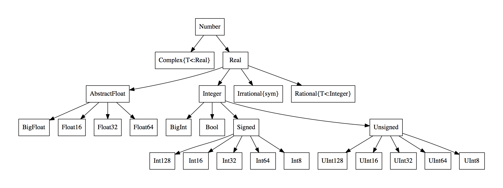

# 5 - Custom structures

Structures \(previously known in Julia as "Types"\) are, for the most \(see later for the difference\), what in other languages are called classes, or "structured data": they define the kind of information that is embedded in the structure, that is a set of fields \(aka "properties" in other languages\), and then individual instances \(or "objects"\) can be produced each with its own specific values for the fields defined by the structure.

Some syntax that will be used in the examples:

* `a::B` means "a must be of type B"
* `A<:B` means "A must be a subtype of B".

## Defining a structure

```text
mutable struct MyOwnType
  property1
  property2::String
end
```

For increasing performances in certain circumstances, you can optionally specify the type of each field, as done in the previous example for `property2.`

You can use templates also in structure declaration:

```text
mutable struct MyOwnType{T<:Number}
 property1
 property2::String
 property3::T
end
```

You can omit the `mutable` keyword in place of `struct` when you want to enforce that once an object of that type has been created, its fields can no longer be changed \(i.e. , structures are immutable by default\). Although obviously less flexible, immutable structures are much faster.

You can create abstract types using the keyword `abstract type`. Abstract types do not have any field, and objects can not be instantiated from them, although concrete types \(structures\) can be defined as subtypes of them \(an [issue](https://github.com/JuliaLang/julia/issues/4935%20) to allow abstract classes to have fields is currently open and may be implemented in the future\).

Actually you can create a whole hierarchy of abstract types:

```text
abstract type MyOwnGenericAbstractType end
abstract type MyOwnAbstractType <: MyOwnGenericAbstractType end
mutable struct AConcreteType <: MyOwnAbstractType
  property1
  property2::String
end
```

## Initialising an object and accessing its fields

```text
myObject = MyOwnType("something","something",10)
a = myObject.property3 # 10
```

## Implementation of the OO paradigm in Julia

Let's take the following example:

```text
struct Person
  myname::String
  age::Int64
end

struct Shoes
   shoesType::String
   colour::String
end

struct Student
   s::Person
   school::String
   shoes::Shoes
end

function printMyActivity(self::Student)
   println("I study at $(self.school) school")
end

struct Employee
   s::Person
   monthlyIncomes::Float64
   company::String
   shoes::Shoes
end

function printMyActivity(self::Employee)
  println("I work at $(self.company) company")
end

gymShoes = Shoes("gym","white")
proShoes = Shoes("classical","brown")

Marc = Student(Person("Marc",15),"Divine School",gymShoes)
MrBrown = Employee(Person("Brown",45),1200.0,"ABC Corporation Inc.", proShoes)

printMyActivity(Marc)
printMyActivity(MrBrown)
```

There are three big elements that distinguish Julia implementation from a pure Object-Oriented paradigm:

1. Firstly, in Julia **you do not associate functions to a type**. So, you do not call a function over a method \(`myobj.func(x,y)`\) but rather you pass the object as a parameter \(`func(myobj, x, y)`\);
2. In order to extend the behaviour of any object, Julia doesn't use _inheritance_ \(**only abstract classes can be inherited**\) but rather _composition_ \(a field of the subtype is of the higher type, allowing access to its fields\). I personally believe that this is a bit a limit in the expressiveness of the language, as the code can not consider directly different concepts of relations between objects \(e.g. Person-&gt;Student _specialisation_, Person-&gt;Arm _composition_, Person-&gt;Shoes _weak relation_ \);
3. **Multiple-inheritance is not supported** \(yet\).

## More on types

To know the parent types of a type: `supertype(MyType)`

To know all children of a type: `subtype(MyType)`

This is the complete type hierarchy of `Number in Julia (credits to Wikipedia):`



