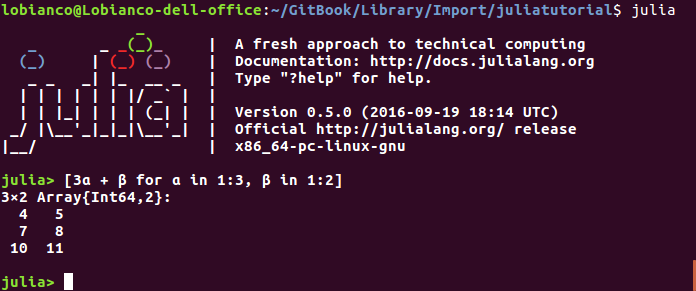

# Introduction



 **Versions from 16 August 2018 are works in progress to Julia 1.0. Use versions before for compatibilities with julia 0.6**   **This version of the tutorial \(from 19 July 2017\) is compatible with Julia 0.6**

While the primary purpose of this tutorial is to help myself in the learning path of the language, it can also be useful to reasonably seasoned programmers that want to code in Julia before reading the 533 pages of the \(outstanding\) [official documentation](https://docs.julialang.org/en/stable/).

This document started as a compendium of several tutorials \(plus the official documentation\), in particular Chris Rackauckas's [A Deep Introduction to Julia](http://ucidatascienceinitiative.github.io/IntroToJulia/), the [Quantecon tutorial](http://lectures.quantecon.org/jl/learning_julia.html), the [WikiBook on Julia](https://en.wikibooks.org/wiki/Introducing_Julia) and [Learn X in Y minutes](https://learnxinyminutes.com/docs/julia/), from which I did borrow several examples.

The focus is on Julia as a generic programming language rather than on domain-specific issues \(but domain-specific topics are covered in the packages section\). The format is in the middle between a classical tutorial and a cheatsheet: the exposition analyses the elements of the language following the typical sections of a programming language tutorial \(_data types, control flows, functions.._\), but the information is given in a pretty concise way, suitable for people that already know the concepts as implemented in other programming languages \(e.g. I will not explain what a `for` loop does, but I will write how to implement it in Julia\).

English is not my primary language, so please be understanding and report me of any errors, both in the language and in the content.

Happy coding with Julia !

Antonello Lobianco

## Latest version

The latest version of this tutorial can be found online on GitBook, at [https://www.gitbook.com/book/sylvaticus/julia-language-a-concise-tutorial/](https://www.gitbook.com/book/sylvaticus/julia-language-a-concise-tutorial/). The corresponing git repo is [here](https://github.com/sylvaticus/juliatutorial).

## Citations

Please cite this tutorial as:

```text
A. Lobianco, (2016), “Julia language: a concise tutorial", GitBook, https://www.gitbook.com/book/sylvaticus/julia-language-a-concise-tutorial/, retrieved xx/xx/xxxx
```

## Acknowledgements

Development of this tutorial was supported by:

* the French National Research Agency through the [Laboratory of Excellence ARBRE](http://mycor.nancy.inra.fr/ARBRE/), a part of the “Investissements d'Avenir” Program \(ANR 11 – LABX-0002-01\).

